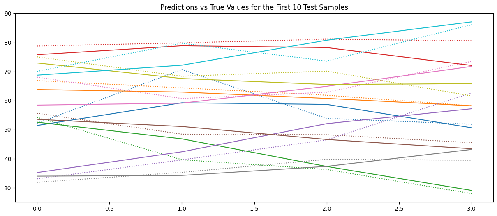

# RSI-Based Algorithmic Trading

## 📈 Overview
This project implements an **algorithmic trading strategy** using the **Relative Strength Index (RSI)** to identify potential buy and sell opportunities in financial markets. The strategy analyzes price trends, detects overbought/oversold conditions, and executes trades accordingly.

## ⚡ Features
- Calculates RSI for selected assets
- Implements an automated trading strategy
- Visualizes price trends and RSI indicators
- Backtesting capabilities to evaluate performance
- Customizable parameters for different market conditions

## 🛠️ Installation & Usage
```bash
# Clone the repository
git clone https://github.com/Retrospek/AlgorithmicTrading.git
cd AlgorithmicTrading

# Install dependencies
pip install -r requirements.txt

# Run the strategy
python rsi_strategy.py
```

## 📊 Trading Strategy Explanation
- **RSI Calculation:** Measures momentum by comparing the magnitude of recent gains to recent losses.
- **Overbought Condition:** RSI > 70 → Potential **sell** signal.
- **Oversold Condition:** RSI < 30 → Potential **buy** signal.
- **Trade Execution:** Uses a rule-based system to enter/exit trades based on RSI thresholds.

## 📌 Example RSI Chart


## 📂 Project Structure
```
AlgorithmicTrading/
│── rsi_strategy.py           # Main script for RSI-based trading  
│── backtesting.py            # Code to evaluate strategy performance  
│── data/                     # Historical market data (optional)  
│── utils.py                  # Helper functions for calculations  
│── requirements.txt          # Dependencies  
│── README.md                 # Project documentation  
│── notebooks/                # Jupyter notebooks for analysis  
│── images/                   # RSI charts, backtest results, etc.  
```

## 💡 Next Steps & Improvements
- Implement **stop-loss and take-profit mechanisms**
- Integrate with **live trading APIs (Alpaca, Binance, etc.)**
- Add **machine learning enhancements** for adaptive RSI tuning
- Explore **multi-indicator strategies** (e.g., RSI + MACD)

## 📜 License
This project is licensed under the MIT License. Feel free to use and modify it as needed.

---

🚀 *Developed by [Arjun Mahableshwarkar](https://github.com/Retrospek). Contributions are welcome!*
